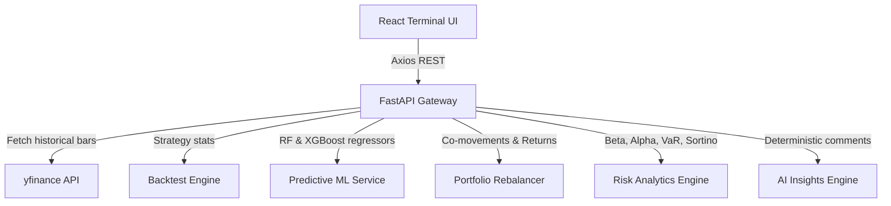

# QuantX: Quantitative Trading & Analytics Terminal

QuantX is a full-stack, TradingView-style quantitative analysis and portfolio management dashboard. It is engineered with a **FastAPI** backend for math computation and a **React + Recharts** frontend styled with a Bloomberg-terminal dark theme.

The system is designed for active research, stock analytics, signal cross-overs, machine learning prediction, systematic risk analytics, and multi-asset portfolio rebalancing.

---

## Technical Architecture



### Backend (Python 3.10+)
- **FastAPI**: Asynchronous web framework for low-latency JSON response delivery.
- **Pandas & NumPy**: Advanced series alignment, vector calculations, and correlation matrices.
- **Scikit-Learn & XGBoost**: Real-time regression modeling (Random Forest Regressor vs. XGBoost Regressor) trained dynamically on historical technical indicators.
- **yfinance**: Real-time market feed wrapper.

### Frontend (React & CSS)
- **Vite**: Ultra-fast hot module reloading and production builds.
- **Recharts**: High-performance interactive SVG chart visualizations (supports Brush-zoom, legends, and custom tooltips).
- **Vanilla CSS Layouts**: CSS Grid structures and custom dark-theme card components matching premium trading terminals.

---

## Core API Endpoints

| Method | Endpoint | Description |
| :--- | :--- | :--- |
| `GET` | `/stock/{ticker}` | Returns price, volume, SMA50, SMA200, RSI, MACD, and a consensus signal. |
| `GET` | `/history/{ticker}` | Returns dates, close values, SMA50, and SMA200 lists for charting. |
| `GET` | `/signal/{ticker}` | Generates isolated indicator signals and MACD trend badges. |
| `GET` | `/backtest/{ticker}` | Simulates a 2Y SMA50/SMA200 crossover strategy vs. Buy & Hold. |
| `GET` | `/predict/{ticker}` | Runs RF/XGBoost regressors to forecast the next day's Close price. |
| `GET` | `/insight/{ticker}` | Compiles technical signals into deterministic reasoning commentary. |
| `GET` | `/risk/{ticker}` | Evaluates Beta, Alpha, daily VaR (95%), and Sortino ratio vs. SPY. |
| `GET` | `/portfolio` | Computes aggregate expected return, volatility, and correlation heatmaps. |

---

## Local Setup Instructions

### 1. Backend Setup
Navigate into the `backend` directory, set up your Python environment, and start the development server:
```bash
cd backend
python -m venv venv
# On Windows
.\venv\Scripts\activate
# On macOS/Linux
source venv/bin/activate

pip install -r requirements.txt
uvicorn main:app --host 127.0.0.1 --port 8000 --reload
```

### 2. Frontend Setup
Navigate into the `frontend` directory, install packages, and start Vite:
```bash
cd frontend
npm install
npm run dev
```
Open `http://localhost:5173` in your browser.

---

## Cloud Deployment Guide

### Backend (Render)
1. Link your GitHub repository to a new **Web Service** on Render.
2. Set Environment Variables:
   - `PYTHON_VERSION`: `3.10.x`
3. Configure settings:
   - Build Command: `pip install -r requirements.txt`
   - Start Command: `uvicorn main:app --host 0.0.0.0 --port $PORT`

### Frontend (Vercel)
1. Create a new project on Vercel and import the frontend folder.
2. Edit output directory settings:
   - Build Command: `npm run build`
   - Output Directory: `dist`
3. Set environment variable `VITE_API_URL` to point to your live Render backend backend API URL (update `api.js` if utilizing dynamic hosts).
